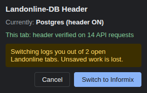

# Landonline-DB Header

A Chrome extension for testing Landonline against the **Postgres** backend instead of **Informix**.

When switched on, it adds the header `Landonline-DB: postgres` to requests sent to `*.landonline.govt.nz` and `*.linz.govt.nz`. The load balancer uses this header to route requests to the Postgres backend. Without the header, requests go to Informix.

The extension also shows a banner on Landonline pages. The banner reports what was **actually sent** on the page's API requests, not just whether the extension is switched on. Green means the header really went out.

## Install

1. Get the code: clone this repository, or download it and unzip it.
2. Open `chrome://extensions` and turn on **Developer mode** (top right).
3. Click **Load unpacked** and choose the folder that contains `manifest.json`.
4. Pin the extension: puzzle-piece icon in the toolbar → pin **Landonline-DB Header**.

### Update to a new version

- **If you loaded the extension from this folder before:** update the folder (`git pull`), then click **↻** on the extension's card in `chrome://extensions`.
- **If you loaded it from a different folder:** first click **Remove** on the old card, then follow the install steps. Two copies installed at the same time will interfere with each other.

Check that the card shows the expected version.

## Switching between Postgres and Informix

Click the extension icon in the toolbar to open the popup.



The popup shows:

- **Currently:** which backend you're on.
  - "Postgres (header ON)" means the header is being added.
  - "Informix (header OFF)" means it isn't.
- **This tab:** the verified status of the current tab, when it's a Landonline page.
- **A warning** with the number of Landonline tabs that will be logged out, if any are open.

Click **Switch to Postgres** or **Switch to Informix** to switch, or **Cancel** to leave things as they are.

### Switching logs you out

Informix and Postgres each have their own login server (Keycloak), at the same address. A login made against one backend is not valid for the other. So every switch logs you out:

- Every open `*.landonline.govt.nz` tab is reloaded and sent to the login page.
- You log in again, this time against the backend you switched to.

**Save your work before switching.** Anything unsaved in an open Landonline tab is lost when the tab reloads.

Not affected by a switch:
- Tabs on `*.linz.govt.nz`, such as the LINZ website.
- Your "trusted device" setting, so you aren't asked for MFA again.
- Your remembered username.

Internal users who sign in with their LINZ (Microsoft) account may be signed straight back in without typing a password. That's expected: you still get a new login on the correct backend.

### Back to Informix when Chrome restarts

Postgres is a test mode you switch on deliberately, so it doesn't carry over. The extension goes back to **Informix (OFF)** when:
- Chrome quits and starts again. On macOS, closing all windows doesn't quit Chrome; use ⌘Q.
- The extension is updated.
- The extension is disabled and enabled again.

If you were on Postgres when that happened, your open Landonline tabs are logged out and reloaded, as for a switch. Switch to Postgres again from the popup if you still need it.

Closing a window or tab doesn't change anything. All windows and tabs in a Chrome profile share the same setting. To compare backends side by side, use two Chrome profiles: each has its own setting.

## The banner

When the extension is on, a banner at the top of each Landonline page shows whether the header was actually sent on that page's API requests.

| Banner | Meaning | What to do |
|---|---|---|
|  | **Amber – waiting for first API request.** Postgres is switched on, but the page hasn't made an API request yet, so nothing has been checked. | Carry on using the app. It turns green after the first API request. |
|  | **Green – Connected to Postgres.** Every API request from this page so far carried the header. | Nothing. You're testing against Postgres. |
|  | **Red – NOT on Postgres.** At least one API request from this page went out **without** the header. It shows how many, and the address of the last one. | Don't trust results from this page. Reload the page. If it turns red again, report it with the address shown. |
| *(red)* | **Red – Header OFF but still sent.** The extension is switched off, but an API request still carried the header. | Don't trust results from this page. Report it. |
| *(no banner)* | The extension is switched off, so you're on Informix. Or the extension isn't running (disabled or removed). | Nothing, unless you meant to test Postgres. |

How the banner behaves:
- **A red banner stays red** until the page is reloaded or you go to another page, even if later requests are fine.
- **Only API requests are checked** (XHR/fetch from the page). Page loads, images and scripts also get the header, but they don't change the banner.
- **Requests made by an app's own service worker aren't counted.** Those can't be tied to a tab.

### Toolbar badge

The toolbar icon has a small badge for the current tab:

- **✓** (green): verified.
- **!** (red): a request went out with the wrong header state.
- No badge: nothing checked yet, or the extension is switched off.


The icon itself is coloured when the extension is on, and grey when it's off. Chrome occasionally doesn't redraw the icon straight after a switch. Hover over it to refresh it. The tooltip always shows the correct state.

## Troubleshooting

- **The banner is green but I think I'm on Informix.** The banner only turns green when the header was seen on this page's API requests, so the request did leave the browser with the header. What the load balancer and backend services do with it after that is outside the extension.
- **No banner at all.**
  - Check the extension is switched on: open the popup.
  - Check the page is on `*.landonline.govt.nz` or `*.linz.govt.nz`.
  - If you just installed or re-enabled the extension, reload the page.
- **I want to see the red banner** (for example, to show testers what it looks like):
  1. Switch the extension on and open a Landonline page.
  2. Go to `chrome://extensions` → Landonline-DB Header → **service worker** to open its console.
  3. Run:
     ```js
     chrome.declarativeNetRequest.updateDynamicRules({ removeRuleIds: [1] })
     ```
  4. Do anything in the app that makes an API request. The banner turns red.
  5. Switch the extension off and on again to restore it.

## How it works (for developers)

- **`background.js`**, the service worker:
  - The on/off state is stored in `chrome.storage.session` (`isEnabled`). Everything else follows changes to it.
  - **Header:** a `declarativeNetRequest` session rule sets `Landonline-DB: postgres` (and `landonline: postgres`) for `requestDomains` `landonline.govt.nz` and `linz.govt.nz`. That covers any subdomain and any port.
  - **Verification:** `webRequest.onSendHeaders` sees the request headers after the rule has been applied. For each tab, it counts API requests (`xmlhttprequest`) sent with and without the header. The counts are kept in `chrome.storage.session`, so they survive service worker restarts. They reset when the tab navigates, and when the extension is switched.
  - **Re-login on switch:**
    1. Deletes Keycloak's SSO cookies on `auth.*` under `/realms/` (`KEYCLOAK_IDENTITY`, `KEYCLOAK_SESSION`, `AUTH_SESSION_ID`, `KC_RESTART`, `KC_AUTH_SESSION_HASH`). `KEYCLOAK_TRUSTED_DEVICE` and `KEYCLOAK_REMEMBER_ME` are kept.
    2. In each `*.landonline.govt.nz` tab, removes the `oidc.*` tokens that `@linz/lol-auth-js` keeps in sessionStorage.
    3. Reloads the tab. The app then redirects to the Keycloak login.
  - **New session:** the state and the header rule are session-scoped, so Chrome clears them on browser restart and on extension update, reload or re-enable. Every session starts OFF.
    - A `postgresSession` flag in `chrome.storage.local` remembers that the previous session was on Postgres. If it's set, the new session runs the same logout as a switch.
    - A `runtime.onStartup` listener makes the service worker start with the browser, so this happens straight away.
    - Any persistent dynamic rule left by earlier versions is removed.
  - **Re-injection:** whenever the service worker starts, it injects `content.js` into open Landonline tabs. This covers install, update, re-enable and browser start.
- **`content.js`** draws the banner:
  - It asks the background for the tab's status every second, and only touches the page when the status changes.
  - If the extension has been disabled, reloaded or removed, it removes the banner instead of leaving it showing.
- **`popup/`** is the switch popup. It flips `isEnabled` in storage, and `background.js` does the rest.

### Permissions

| Permission | Why |
|---|---|
| `declarativeNetRequest`, `declarativeNetRequestWithHostAccess` | Add the header to requests. |
| `webRequest` | See which headers were actually sent, for the banner. Observe only: it can't change or block requests. |
| `cookies` | Remove the Keycloak login cookies when switching. |
| `storage` | Remember on/off, and the per-tab results. |
| `scripting` | Show the banner in tabs that were already open, and clear the login tokens when switching. |
| Host access to `*.landonline.govt.nz`, `*.linz.govt.nz` | All of the above only apply to these sites. |
